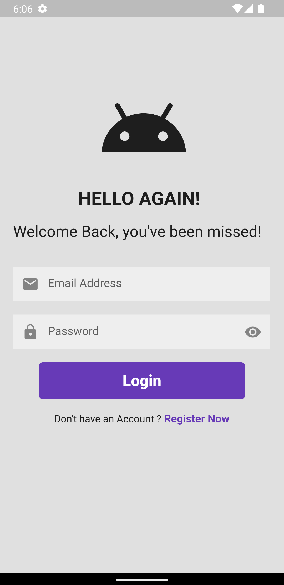
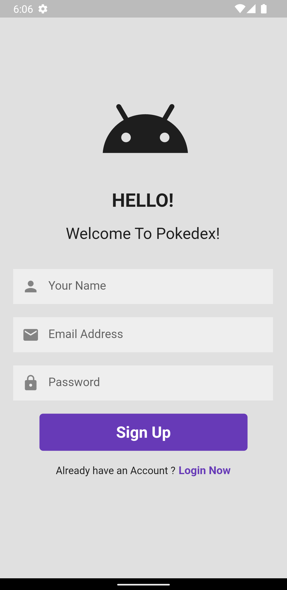
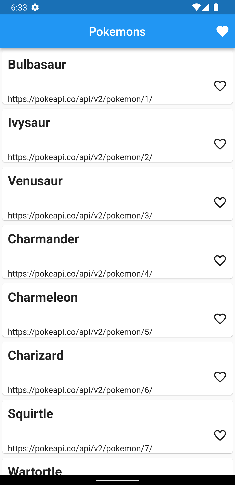
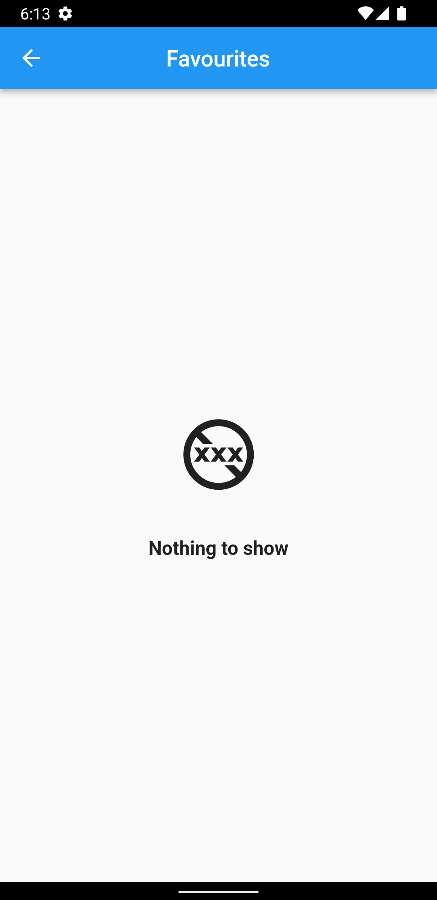

# POKEDEX

A simple application created using BLOC (cubit).
The main aim was to learn bloc, hive etc.

## Screenshots

        

   

## API Reference

API : https://documenter.getpostman.com/view/10670805/SzS2xToN#be879560-9b35-4fe7-ba0a-fb4c43bfd26f